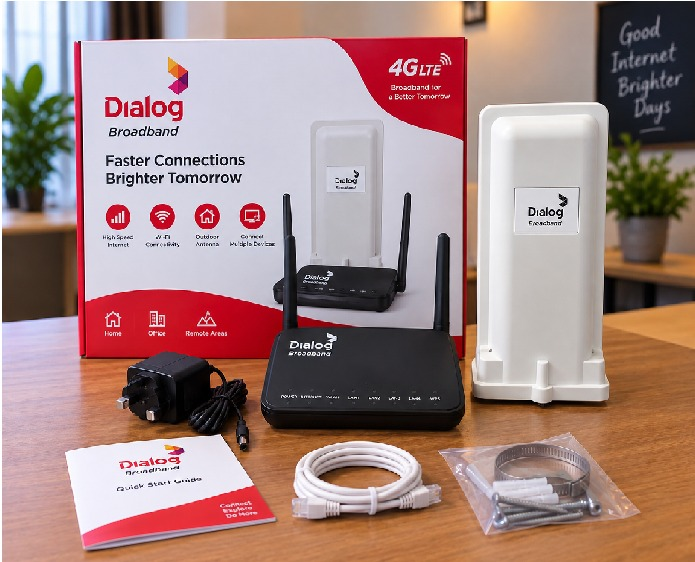

# Router Internet Speed Monitor

A Chrome Manifest V3 extension for monitoring and managing a **Dialog Sri Lanka ZLT P11 Outdoor LTE CPE** directly from the browser.

The project communicates with the router's local web API and provides live internet speed, LTE signal information, Wi-Fi visibility controls, connected-device monitoring, device verification, and router diagnostics.

> Target device used during development:
>
> - **Router:** Dialog Sri Lanka ZLT P11 Outdoor LTE CPE
> - **Software:** 40.8
> - **Configuration:** Sri Lanka Dialog V9.8
> - **Default router address:** `http://192.168.8.1`

---

## Router Used for This Project



The project has been developed and tested around the Dialog-branded ZLT P11 outdoor LTE router shown above.

The router normally consists of:

- Outdoor LTE CPE / antenna unit
- Indoor Wi-Fi router
- PoE / power equipment
- Ethernet connection between the outdoor and indoor units

The APIs documented in this repository are firmware-specific and should not automatically be assumed to work with other ZLT models or firmware versions.

---

## Screenshots

### Extension Popup


The popup provides a compact real-time view of the router and internet connection.

It includes:

- Upload speed
- Download speed
- Signal strength
- Router connection status
- Wi-Fi SSID visibility
- Show / hide Wi-Fi controls
- Manual refresh
- Open Live Monitor
- Open Settings

### Live Monitor / New Tab Page


The full-page Live Monitor provides a larger dashboard for long-running monitoring.

It includes:

- Live upload and download speed
- Signal information
- Wi-Fi visibility controls
- Router/WAN information
- Connected / leased device list
- Device aliases
- Verified / trusted devices
- New-device detection
- Red warning state for newly detected MAC addresses
- Light / dark theme switching

### Settings Page


The Settings page is used to configure the extension.

It includes:

- Router address
- Router administrator username
- Router password
- Connection test
- Refresh interval
- Speed display unit
- Theme preference
- New-device monitoring information

---

## Main Features

- Real-time upload and download speed monitoring
- `KB/s` and `Mbps` display modes
- Router RSSI / signal display
- Automatic authentication and retry after session expiry
- Wi-Fi SSID visibility detection
- Hide or show the Wi-Fi SSID
- Full-page Live Monitor
- Configurable light and dark themes
- Connected / DHCP-leased device list
- Device hostname, IP address, MAC address and lease time
- Custom device names stored locally by MAC address
- Mark devices as verified / trusted
- Detect newly observed MAC addresses
- Red `NEW DEVICE` warning state
- Chrome notification for newly detected devices
- Router LTE/cell diagnostic API discovery
- API documentation
- Importable Postman collection

---

## Connected Device Monitoring

The extension uses the router's verified `CMD 121` API to retrieve the DHCP client list.

A device entry contains:

```text
IP Address
MAC Address
Hostname
Remaining DHCP Lease Time
```

Example:

```text
My Laptop
192.168.8.106
AA:BB:CC:DD:EE:FF
Lease: 23:54:27
```

### Custom Device Names

A device can be renamed locally inside the extension.

For example:

```text
AA:BB:CC:DD:EE:FF
Unknown device
        ↓
Living Room TV
```

The alias is stored locally against the MAC address.

### Device Verification

Devices can be marked as:

```text
VERIFIED / My Device
UNVERIFIED
NEW DEVICE
```

When a MAC address appears for the first time after the initial baseline, the extension marks it in red as a new device.

> Modern phones and laptops can use private/randomized Wi-Fi MAC addresses. A physical device may therefore appear with a different MAC address after privacy settings or network settings change.

---

## LTE / Cell Diagnostics

The router exposes radio diagnostics through `CMD 186`.

The verified request currently includes:

```text
AT+TZEARFCN?
AT+TZBAND?
AT+TZBANDWIDTH?
AT+TZTRANSMODE?
AT+TZRSRP?
AT+TZRSRQ?
AT+TZSINR?
AT+TZTA?
AT+TZTXPOWER?
AT+CEREG?
AT+TZGLBCELLID?
AT+TZPHYCELLID?
```

The response can provide:

- EARFCN
- LTE band
- Bandwidth
- Transmission mode
- RSRP
- RSRQ
- SINR
- Timing Advance
- TX power
- Tracking Area Code
- Global Cell ID / ECI
- eNodeB ID
- Cell / sector ID
- Physical Cell ID / PCI

Example verified values:

```text
EARFCN:            38948
Band:              40
Bandwidth:         100
RSRP:              -104 dBm
RSRQ:              -11 dB
SINR:              4 dB
Global Cell ID:    633601
eNodeB / Cell ID:  2475 / 1
Physical Cell ID:  430
```

Long-term signal/cell history is planned so the extension can track signal quality and cell changes over time.

---

## Wi-Fi Visibility

The router's `CMD 117` API is used to read and update Wi-Fi configuration.

The verified SSID visibility field is:

```text
macinfo_broadcast = 0  -> SSID visible
macinfo_broadcast = 1  -> SSID hidden
```

The extension first reads the current Wi-Fi configuration and preserves the remaining configuration values before changing the visibility field.

---

## Router Access Rules

The router uses `CMD 23` to save IPv4/IPv6 MAC access rules and `CMD 20` to apply them.

Example rule:

```json
{
  "enableRule": true,
  "enableLink": false,
  "remark": "Example IPv4 rule",
  "ippro": "IPV4",
  "mac": "AA:BB:CC:DD:EE:FF"
}
```

Observed behavior:

```text
enableLink = true   -> connection allowed
enableLink = false  -> connection blocked
```

Rule workflow:

```text
Build complete rule list
        ↓
POST CMD 23
        ↓
Verify success=true
        ↓
POST CMD 20
        ↓
Apply changes
```

---

## Router API Documentation

Detailed notes for the verified router APIs are available here:

```text
docs/router-api.md
```

Current documented commands:

| CMD | Purpose |
|---|---|
| `0` | Router status and WAN counters |
| `100` | Authentication |
| `117` | Wi-Fi configuration / SSID visibility |
| `121` | DHCP client / device list |
| `23` | Save IPv4 / IPv6 MAC access rules |
| `20` | Apply / commit access rules |
| `186` | LTE / cell radio diagnostics |

These APIs were discovered from the router's own web interface and tested against the target Dialog ZLT P11 firmware.

---

## Postman Collection

An importable Postman collection is included:

```text
postman/Dialog-ZLT-P11-Router-API.postman_collection.json
```

Import it in Postman using:

```text
Import
→ File
→ Dialog-ZLT-P11-Router-API.postman_collection.json
```

The collection uses variables such as:

```text
{{baseUrl}}
{{sessionId}}
{{username}}
{{passwordHash}}
{{mac}}
```

Do not commit real credentials or active session information.

---

## Installation

1. Clone the repository.

```bash
git clone https://github.com/lmadhuranga/Router-Internet-Speed-Monitor-Chrome-ex.git
cd Router-Internet-Speed-Monitor-Chrome-ex
```

2. Open Chrome:

```text
chrome://extensions/
```

3. Enable **Developer mode**.

4. Click **Load unpacked**.

5. Select the extension directory containing `manifest.json`.

6. Pin **Router Internet Speed Monitor** to the Chrome toolbar.

---

## Recommended Project Structure

```text
Router-Internet-Speed-Monitor-Chrome-ex/
├── manifest.json
├── background.js
├── core.js
├── storage.js
├── md5.js
│
├── popup.html
├── popup.css
├── popup.js
│
├── monitor.html
├── monitor.css
├── monitor.js
│
├── options.html
├── options.css
├── options.js
│
├── docs/
│   ├── router-api.md
│   │
│   ├── images/
│   │   └── dialog-zlt-p11-router-kit.png
│   │
│   └── screenshots/
│       ├── router-monitor-popup.png
│       ├── router-monitor-live-monitor.png
│       └── router-monitor-settings.png
│
├── postman/
│   └── Dialog-ZLT-P11-Router-API.postman_collection.json
│
├── tests/
│   ├── core.test.js
│   ├── md5.test.js
│   └── storage.test.js
│
└── README.md
```

---

## Screenshot File Names

Use these exact filenames when you capture the application screenshots:

```text
docs/screenshots/router-monitor-popup.png
docs/screenshots/router-monitor-live-monitor.png
docs/screenshots/router-monitor-settings.png
```

Use this filename for the generated router image:

```text
docs/images/dialog-zlt-p11-router-kit.jpg
```

This keeps the README paths stable and avoids needing to edit Markdown each time screenshots are replaced.

---

## Security

Do not commit any of the following:

- Router administrator password
- Password hashes
- Active `sessionId`
- `SessionID` cookies
- Wi-Fi passwords
- IMEI
- IMSI
- ICCID
- Other private router or subscriber identifiers

The extension stores configuration locally in Chrome.

Passwords should not be stored as plaintext.

---

## Compatibility

This project currently targets:

```text
Dialog Sri Lanka
ZLT P11 Outdoor LTE CPE
Software 40.8
Sri Lanka Dialog V9.8
```

Other ZLT routers such as P11H, P11X, or other firmware variants may expose different API commands, response formats, or configuration fields.

---

## Disclaimer

This is an independent monitoring and management project based on behavior observed from a locally administered router.

It is not official Dialog or ZLT software.

Use it only with routers and networks that you are authorized to administer.
