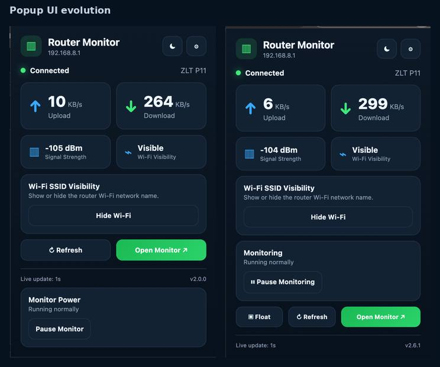
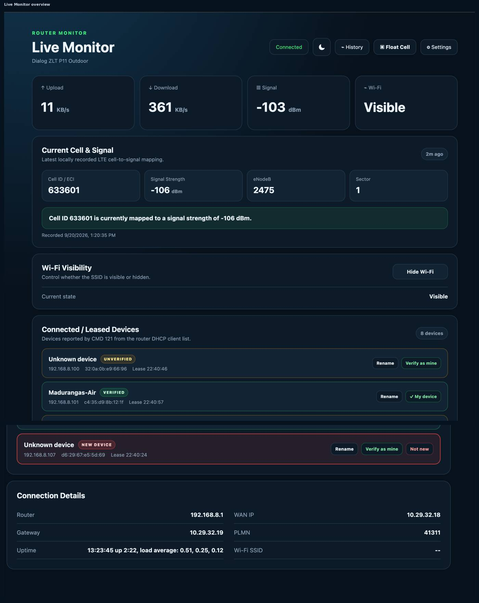
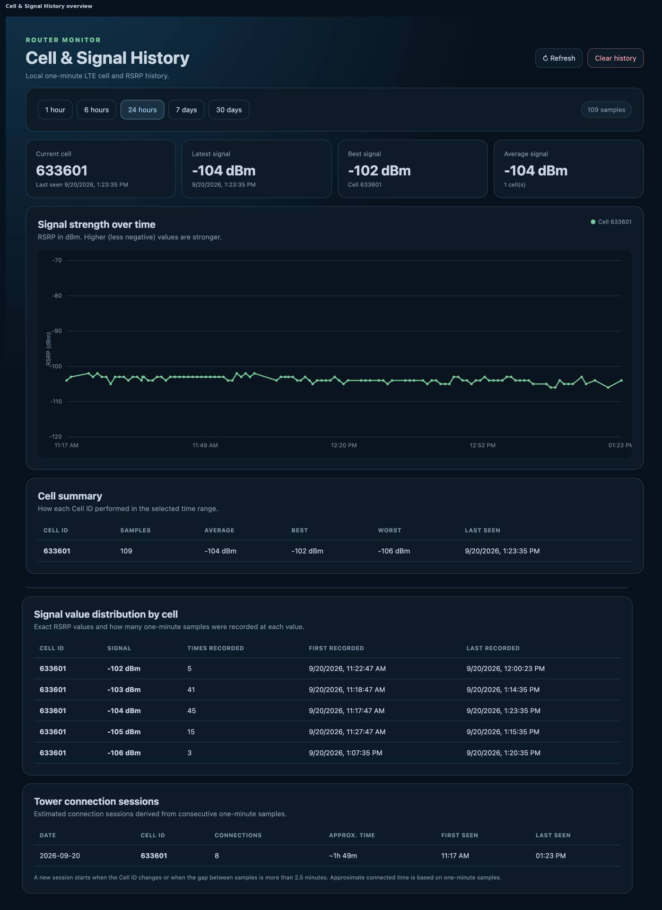
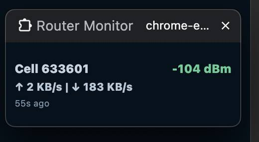

# Router Monitor

A Chrome Manifest V3 extension for monitoring a **Dialog Sri Lanka ZLT P11 Outdoor LTE CPE** directly from the browser.

Router Monitor connects only to the router's local web API and provides live WAN traffic, signal monitoring, Wi-Fi controls, device visibility, LTE cell tracking, local history analytics, and a compact always-on-top floating HUD.

## Target Router

This project has been developed and verified against:

```text
Router:        Dialog Sri Lanka ZLT P11 Outdoor LTE CPE
Software:      40.8
Configuration: Sri Lanka Dialog V9.8
Router URL:    http://192.168.8.1
API endpoint:  http://192.168.8.1/cgi-bin/http.cgi
```

The APIs are undocumented and firmware-specific. Do not assume the same request/response behavior on P11H, P11X, or other ZLT firmware versions.


### Popup Overview

Two popup screenshots combined into a single compressed JPG.



### Live Monitor Overview

Main live-monitor sections combined into a single compressed JPG.



### Cell & Signal History Overview

History chart and analytics tables combined into a single compressed JPG.



### Floating HUD

Compact always-on-top floating window preview.




## Main Features

### Live Router Monitoring

Router Monitor displays:

- live upload speed
- live download speed
- router RSSI / signal strength
- router connection status
- WAN IP
- gateway
- PLMN
- router uptime
- Wi-Fi SSID visibility
- Wi-Fi SSID name

Speed can be displayed as either:

```text
KB/s
Mbps
```

The main router/status request uses `CMD 0` every 0.5 or 1 second depending on the selected refresh interval.

### Compact Extension Popup

The Chrome toolbar popup provides quick access to:

- upload and download speed
- signal strength
- Wi-Fi visibility
- show/hide Wi-Fi
- monitoring pause/resume
- manual refresh
- **Float** HUD
- full Live Monitor
- Settings

The popup can therefore launch the floating monitor without first opening the full dashboard.

### Full Live Monitor

The full-page Live Monitor includes:

- live upload/download traffic
- signal strength
- Wi-Fi visibility controls
- connected / DHCP-leased devices
- router/WAN information
- current LTE Cell ID
- cell signal summary
- Cell & Signal History access
- floating HUD access
- dark/light theme switching

### Floating Always-on-Top HUD

Router Monitor can open a compact Chrome Document Picture-in-Picture window.

Example:

```text
Cell 633601      -92 dBm
↑ 121 KB/s | ↓ 523 KB/s
18s ago
```

The HUD displays:

- current LTE Cell ID / ECI
- live router signal strength
- live upload speed
- live download speed
- age of the latest cell sample

Current size is approximately:

```text
230 × 86 CSS pixels
```

The floating UI uses a dark, low-glare color scheme and stays above normal windows while Chrome keeps the Picture-in-Picture window open.

The HUD can currently be opened from:

- Chrome extension popup
- Live Monitor
- Options page

Chrome requires a user gesture to open Document Picture-in-Picture.

The HUD content uses `pointer-events: none`, but Chrome owns the native Picture-in-Picture window itself. A pure Chrome extension cannot guarantee operating-system-level click-through for the complete outer window.

## LTE Cell & Signal History

Router Monitor collects one LTE cell/signal sample approximately once per minute using `CMD 186`.

The lightweight history request uses:

```text
AT+TZRSRP?
AT+TZGLBCELLID?
```

Each local sample stores:

```text
timestamp
ISO date/time
local date/time
Global Cell ID / ECI
Global Cell ID in hexadecimal
eNodeB ID
sector / cell ID
RSRP signal strength in dBm
```

Example:

```text
Timestamp:      2026-09-20 11:25:00
Global Cell ID: 633601
ECI Hex:        0x0009ab01
eNodeB ID:      2475
Sector ID:      1
RSRP:           -104 dBm
```

Cell identity is derived as:

```text
eNodeB ID = Global Cell ID >> 8
Sector ID = Global Cell ID & 255
```

All history stays in:

```text
chrome.storage.local
```

No external database, cloud service, or remote API is required.

The current rolling limit is:

```text
43,200 samples
≈ 30 days at one sample per minute
```

Collection is skipped while Router Monitor is paused or while the router is unavailable.

## Cell & Signal History Dashboard

The History dashboard helps turn the raw one-minute samples into useful information.

Available ranges:

```text
1 hour
6 hours
24 hours
7 days
30 days
```

The dashboard includes:

- RSRP signal-strength chart over time
- separate visual color for each Cell ID
- current Cell ID
- latest signal
- best signal
- average signal
- per-cell sample count
- per-cell average RSRP
- per-cell best RSRP
- per-cell worst RSRP
- per-cell last-seen timestamp
- exact signal-value frequency
- daily tower connection-session estimates
- manual refresh
- clear local history

### Exact Signal Frequency

For each Cell ID, Router Monitor counts how many one-minute samples occurred at each exact rounded RSRP value.

Example:

```text
Cell 633601

-99 dBm   -> 18 samples
-100 dBm  -> 41 samples
-101 dBm  -> 27 samples
-102 dBm  -> 9 samples
```

Each value also records:

```text
first recorded timestamp
last recorded timestamp
```

This makes it possible to determine which signal levels are most common on a specific LTE cell.

### Tower Connection Sessions

Router Monitor also derives approximate daily connection sessions from timestamped Cell ID samples.

Example:

```text
Date:             2026-09-20
Cell ID:          633601
Connections:      4
Approx. time:     ~2h 18m
First seen:       07:12
Last seen:        21:44
```

A new session is counted when:

- the Cell ID changes
- the calendar day changes
- the gap between samples exceeds 2.5 minutes

Approximate connected time is calculated from one-minute samples, so it should be treated as an estimate rather than exact modem attachment duration.

This history can later support analysis such as:

- which LTE tower/cell is used most often
- how many times a cell was connected to during a day
- approximate time spent on each cell
- strongest and weakest periods
- most common signal strength by cell
- time-of-day signal patterns
- cell switching patterns

## Connected / Leased Devices

Router Monitor uses `CMD 121` to read the router's DHCP client list.

A device entry contains:

```text
IPv4 address
MAC address
Hostname
Remaining DHCP lease time
```

Example:

```text
192.168.8.101
AA:BB:CC:DD:EE:FF
Example-Device
23:56:09
```

This should be treated as a DHCP lease list rather than a guaranteed real-time physical connection list, because a recently disconnected device can remain present until its lease expires.

Connected-device data refreshes every 30 seconds.

### Device Aliases and Verification

Router Monitor can:

- assign a local custom name to a MAC address
- mark a device as verified / trusted
- mark newly observed devices as `NEW DEVICE`
- display unverified devices
- send a Chrome notification when a new MAC address is first detected after the initial baseline

Modern phones and laptops may use randomized/private Wi-Fi MAC addresses, so the same physical device can sometimes appear with a new MAC address.

## Wi-Fi SSID Visibility

Router Monitor uses `CMD 117` to read and update Wi-Fi visibility.

Verified values:

```text
macinfo_broadcast = 0 -> SSID visible
macinfo_broadcast = 1 -> SSID hidden
```

Before changing this field, the extension reads the existing Wi-Fi configuration and preserves the other configuration values.

## Router Connection Alerts

Router Monitor detects router reachability transitions.

When the router disconnects:

- Chrome notification
- disconnect bell
- toolbar badge changes to `OFF`

When the router reconnects:

- Chrome notification
- reconnect bell
- normal speed badge resumes

The initial extension startup state is treated as a baseline and does not trigger a connection/disconnection sound.

Manifest V3 uses an offscreen document for WebAudio because the service worker cannot reliably play audio directly.

## Pause / Resume Monitoring

Monitoring can be paused from the popup.

Available pause options:

```text
1 hour
8 hours
until tomorrow at 8:00 AM
until manually enabled
```

While paused:

- router refresh polling is skipped
- device scans are skipped
- LTE history sampling is skipped
- toolbar badge shows `II`

The popup displays an overlay with **Enable Monitoring** so monitoring can be resumed directly.

## Local Storage

Router Monitor uses `chrome.storage.local` for local settings and state, including:

- router settings
- password hash
- theme
- speed unit
- monitoring pause state
- device aliases
- trusted-device status
- new-device baseline
- LTE Cell ID / RSRP history
- latest cell/signal sample

The extension does not intentionally upload this data to an external service.

## Authentication

The router uses `CMD 100` for authentication.

The extension stores a password hash locally rather than the plaintext password entered into Settings.

Default admin password hash used for the router's default `admin` password:

```text
MD5("admin")
21232f297a57a5a743894a0e4a801fc3
```

Do not commit real credentials, active session IDs, cookies, Wi-Fi passwords, IMEI, IMSI, ICCID, or other private router/subscriber information.

## Verified Router Commands

| CMD | Method field | Purpose |
|---|---|---|
| `0` | `GET` | Router status and WAN byte counters |
| `100` | `POST` | Authentication |
| `117` | `GET` | Read Wi-Fi configuration |
| `117` | `POST` | Update Wi-Fi configuration |
| `121` | `GET` | DHCP client / leased-device list |
| `186` | `POST` | LTE radio / Cell ID diagnostics |
| `23` | `GET` / `POST` | MAC access-rule configuration |
| `20` | `POST` | Apply/commit access-rule changes |

Detailed API notes are available in:

```text
docs/router-api.md
```

## MAC Access-Rule Feature Status

The MAC/device blocking UI and runtime implementation are currently **removed from the active extension**.

The verified `CMD 23` and `CMD 20` documentation is intentionally retained in:

```text
docs/router-api.md
```

This allows the feature to be reused or redesigned later without losing the reverse-engineered router behavior.

There is currently no active device block/unblock button or `CMD 23` polling in Router Monitor.

## Polling / Sampling Intervals

Current normal activity:

| Data | Command | Interval |
|---|---:|---:|
| WAN status / speed | `CMD 0` | 0.5s or 1s |
| DHCP / leased devices | `CMD 121` | 30s |
| LTE Cell ID + RSRP history | `CMD 186` | ~1 minute |

The Live Monitor's history view reads existing local data and does not create an additional LTE diagnostic request merely to render a chart.

## Screenshots

Compressed documentation images added to the repository:

```text
docs/images/dialog-zlt-p11-router-kit.jpg
docs/screenshots/router-monitor-popup-overview.jpg
docs/screenshots/router-monitor-live-monitor-overview.jpg
docs/screenshots/router-monitor-history-overview.jpg
docs/screenshots/router-monitor-floating-hud.jpg
```

 
## Postman Collection

An importable Postman collection is included:

```text
postman/Dialog-ZLT-P11-Router-API.postman_collection.json
```

Useful collection variables include:

```text
{{baseUrl}}
{{sessionId}}
{{username}}
{{passwordHash}}
{{mac}}
```

Never save real active session information in a public repository.

## Installation

Clone the repository:

```bash
git clone https://github.com/lmadhuranga/Router-Internet-Speed-Monitor-Chrome-ex.git
cd Router-Internet-Speed-Monitor-Chrome-ex
```

Then:

1. Open `chrome://extensions/`.
2. Enable **Developer mode**.
3. Click **Load unpacked**.
4. Select the project directory containing `manifest.json`.
5. Pin Router Monitor to the Chrome toolbar.
6. Open Settings and confirm the router URL and login information.
7. Use **Test Connection** before starting long-running monitoring.

## Project Structure

```text
Router-Monitor/
├── manifest.json
├── background.js
├── core.js
├── storage.js
├── md5.js
├── cell-history.js
│
├── popup.html
├── popup.css
├── popup.js
│
├── monitor.html
├── monitor.css
├── monitor.js
│
├── history.html
├── history.css
├── history.js
│
├── options.html
├── options.css
├── options.js
│
├── offscreen.html
├── offscreen.js
│
├── docs/
│   ├── router-api.md
│   ├── images/
│   │   └── dialog-zlt-p11-router-kit.jpg
│   └── screenshots/
│       ├── router-monitor-popup-overview.jpg
│       ├── router-monitor-live-monitor-overview.jpg
│       ├── router-monitor-history-overview.jpg
│       └── router-monitor-floating-hud.jpg
│
├── postman/
│   └── Dialog-ZLT-P11-Router-API.postman_collection.json
│
├── tests/
└── README.md
```

## Development

Run the automated tests with:

```bash
npm test
```

JavaScript syntax can be checked with:

```bash
node --check background.js
node --check popup.js
node --check monitor.js
node --check history.js
node --check options.js
```

## Current Version

```text
2.7.0
```

## Privacy and Security

Router Monitor is designed around a local router connection.

Good practices:

- use it only on a router you are authorized to administer
- do not publish router credentials
- do not publish active session IDs or cookies
- do not expose subscriber identifiers
- remember that local extension storage is not the same as encrypted secret storage
- clear history if you do not want long-term LTE cell records retained locally

## Compatibility

Currently verified target:

```text
Dialog Sri Lanka
ZLT P11 Outdoor LTE CPE
Software 40.8
Sri Lanka Dialog V9.8
```

Other devices and firmware versions may behave differently.

## Disclaimer

Router Monitor is an independent project based on behavior observed from a locally administered router.

It is not official Dialog or ZLT software.
